# JSS Noida Placement Portal

A comprehensive web application designed and developed to manage and streamline the student placement process for JSS Academy of Technical Education, Noida. This portal caters to students, administrators, and placement coordinators by providing a centralized platform for placement activities.

**Live Portal:** [https://jssnoidaplacements.in/](https://jssnoidaplacements.in/)

The screenshots below provide a visual tour of the user interface, categorized by access levels.

---

## 🌐 Public Pages

These pages are accessible to all visitors and provide general information about the placement cell, recruiters, and the core team.

### 1. Home

### 2. About

### 3. Esteemed Recruiters
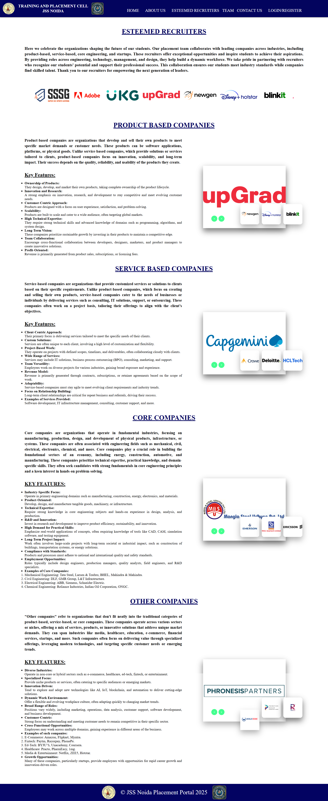

### 4. Administration Team
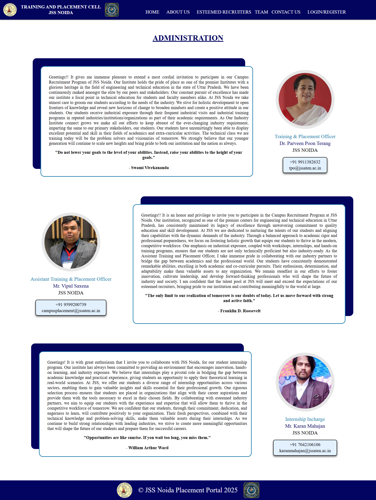

### 5. Core Team
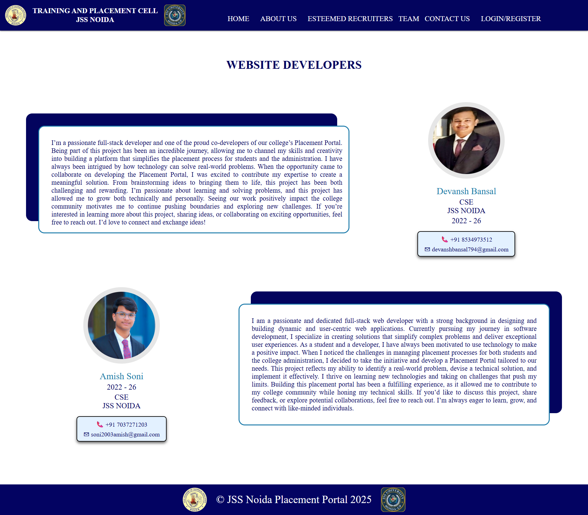

### 6. Placement Secretaries

### 7. Contact
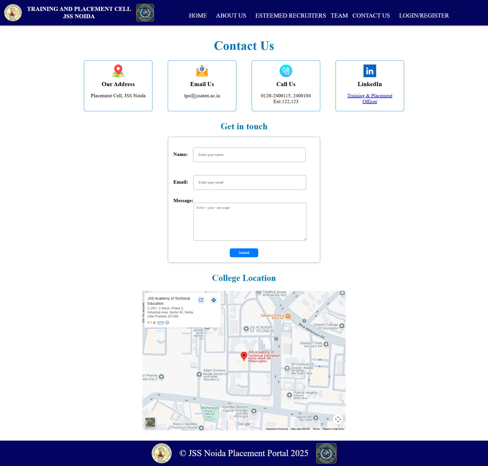

### 8. Login Overlay
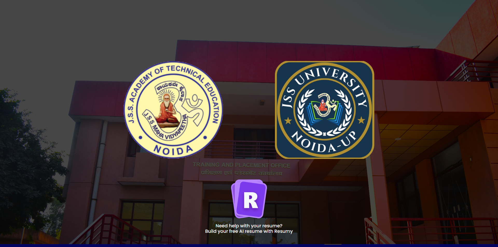

### 9. Login Page
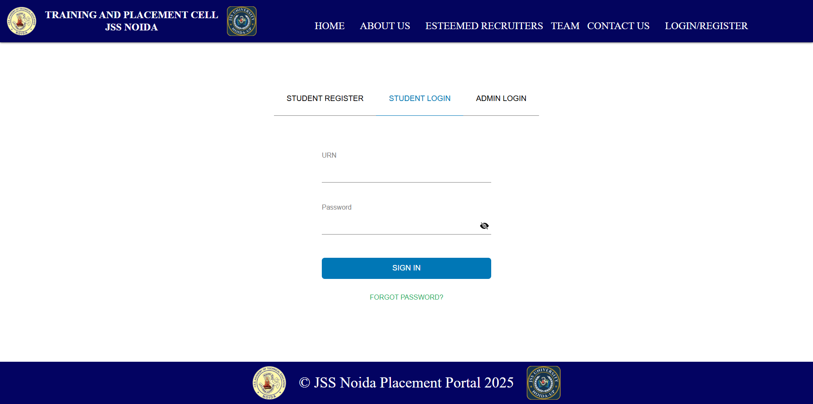

---

## 🎓 Student Portal

Dedicated interfaces for students to manage their profiles, track placement statuses, and view company details.

### 10. Student Login
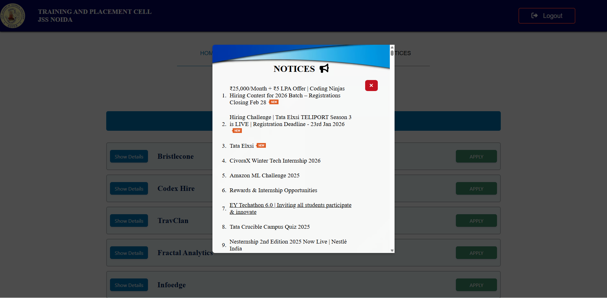

### 11. Student Company Details
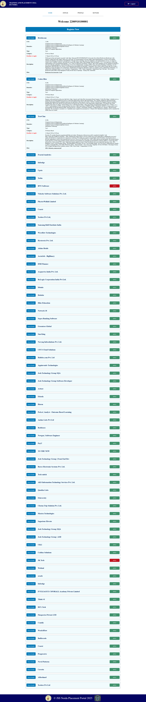

### 12. Student Status
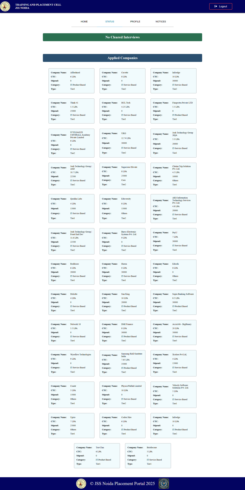

### 13. Student Profile
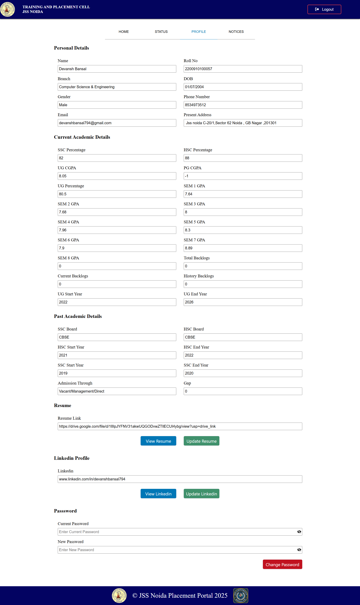

### 14. Student Notices
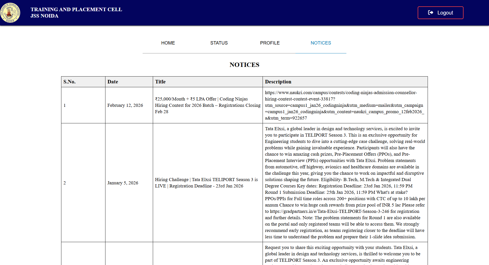

---

## ⚙️ Administration Portal

Secure dashboard and tools for administrators to manage companies, student data, and placement workflows.

### 15. Admin Company Registrations
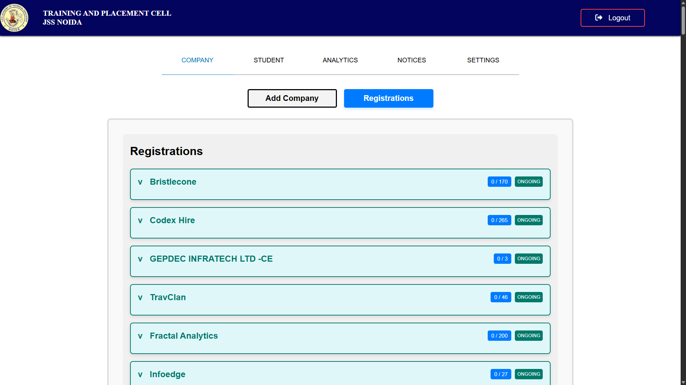

### 16. Admin Company Details
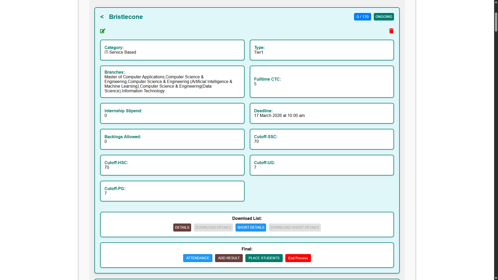

### 17. Admin Download Student Details
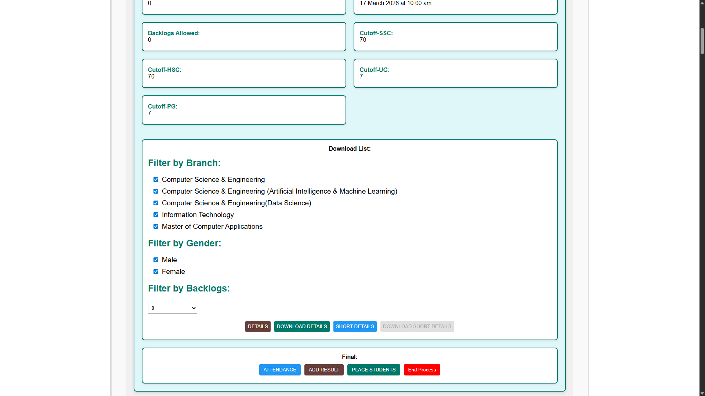

### 18. Admin Student Attendance
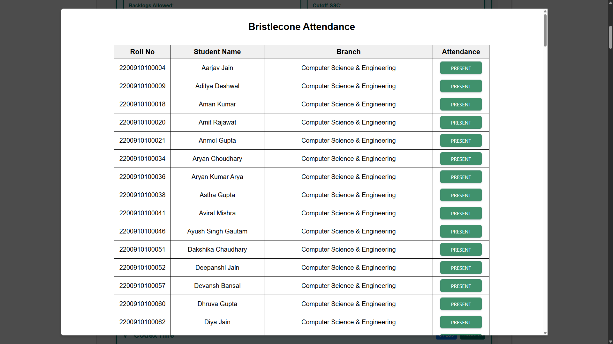

### 19. Admin Place Students
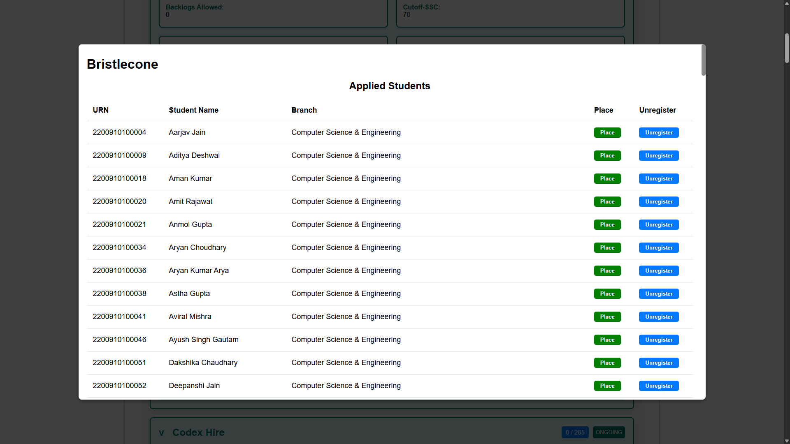

### 20. Admin Add Company
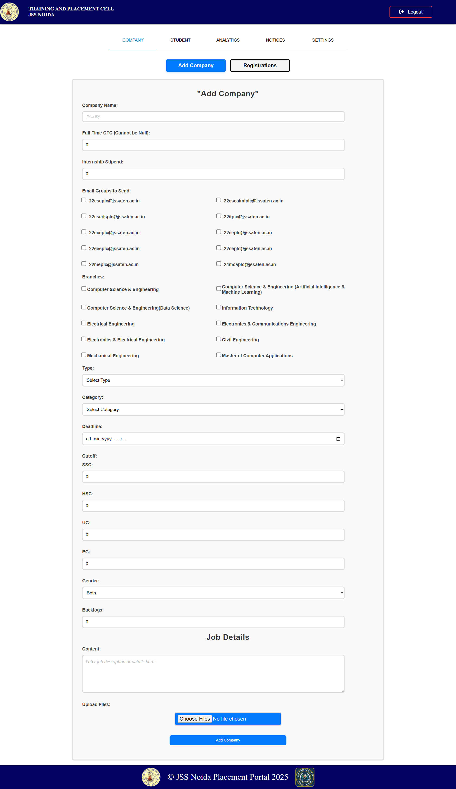

### 21. Admin Analytics

### 22. Admin Notices
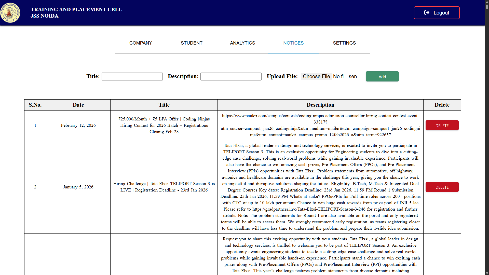
